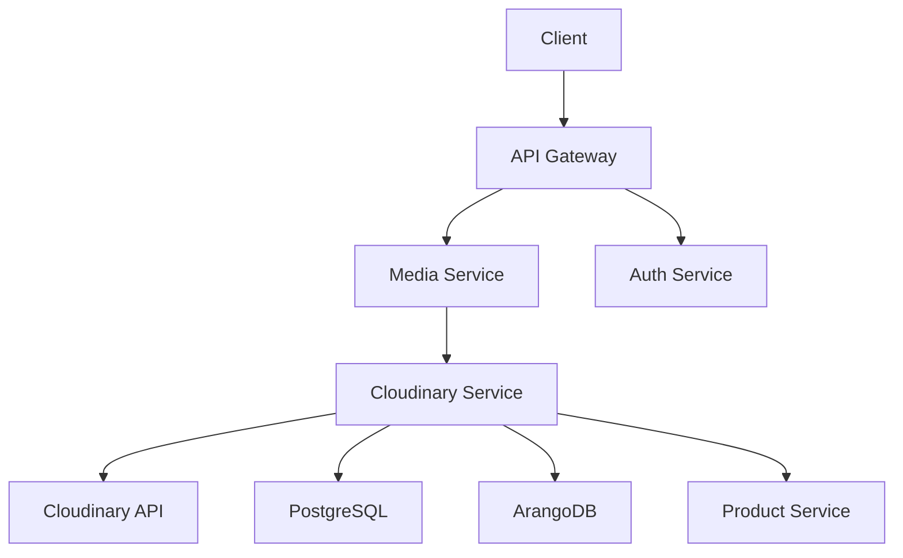

# Cloudinary Service Architecture

This document describes the technical design of the Cloudinary service, which manages Cloudinary assets within the microservice.

## Service Architecture

The Cloudinary service is defined by the `Service` interface and implemented by the `service` struct. It consists of:

- **API Client**: Interacts with Cloudinary’s API for operations like signing upload URLs and deleting assets.
- **Database Layer**: Manages asset records in PostgreSQL and metadata in ArangoDB.
- **Business Logic**: Validates requests, coordinates with other services, and ensures data consistency.

The service follows a layered architecture:

1. **Handler Layer**: Processes incoming requests (e.g., gRPC/HTTP).
2. **Service Layer**: Implements business logic (e.g., `CreateSignedUploadURL`).
3. **Repository Layer**: Handles database operations.

## Interactions

- **Cloudinary API**: Used for asset operations (e.g., signing URLs, deleting assets).
- **Product Service**: Coordinates asset-related requests (e.g., owner updates).
- **Databases**:
  - **PostgreSQL**: Stores core asset records (e.g., ID, PublicID, URLs, state) via GORM.
  - **ArangoDB**: Stores asset ownership metadata, linking assets to their owners (e.g., products).
- **API Gateway**: Routes requests and handles authentication.

## Data Flow

1. A request (e.g., create signed upload URL) is received via the API Gateway.
2. The request is routed to a handler in the Media Service, which calls the appropriate Cloudinary service method.
3. The service method executes its business logic, interacting with databases and external services as needed.
4. A response is returned to the client.

See [API Reference](./api.md) for method-specific details.

## Design Decisions

- **Use of `map[string]string`**: The `CreateSignedUploadURL` method returns a `map[string]string` containing the necessary parameters (signature, timestamp, etc.) for the client to construct the final signed upload URL.
- **Transactional Database Operations**: Asset deletion uses transactions to ensure consistency across PostgreSQL and ArangoDB.
- **Separation of Concerns**: The service delegates authentication to the API Gateway and owner management to the media service.

## Diagram

Below is a high-level architecture diagram of the Cloudinary service:

