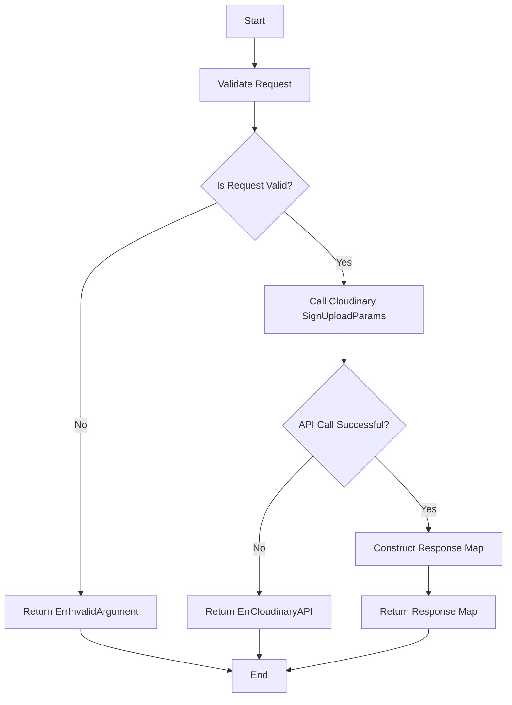

# CreateSignedUploadURL Flowchart

This document illustrates the low-level logic of the `CreateSignedUploadURL` method in the Cloudinary service.

## Flowchart

```mermaid
graph TD
    A[Start] --> B[Validate Request]
    B --> C{Is Request Valid?}
    C -->|No| D[Return ErrInvalidArgument]
    C -->|Yes| E[Call Cloudinary SignUploadParams]
    E --> F{API Call Successful?}
    F -->|No| G[Return ErrCloudinaryAPI]
    F -->|Yes| H[Construct Response Map]
    H --> I[Return Response Map]
    D --> J[End]
    G --> J
    I --> J
```
