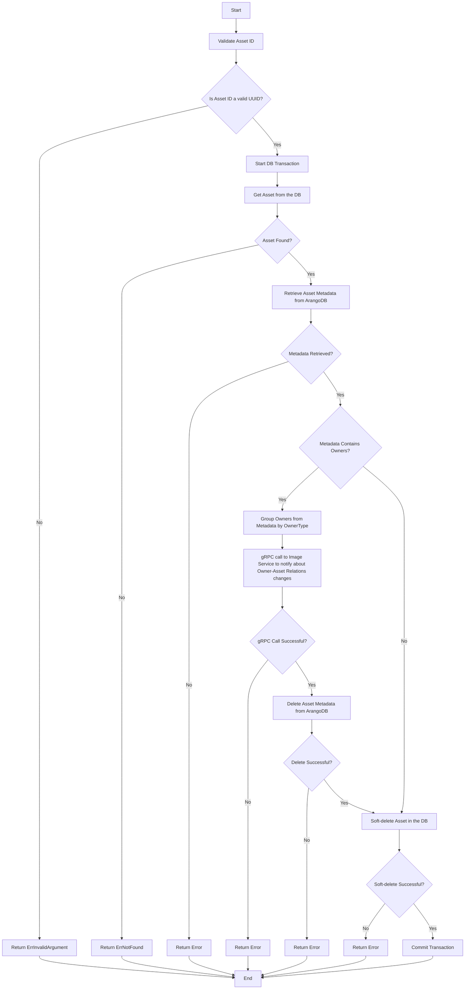

# CleanupOrphanAssets Flowchart

This document illustrates the low-level logic of the `CleanupOrphanAssets` method in the Cloudinary service.

## Flowchart

```mermaid
graph TD
    A["Start"] --> B["Validate Asset ID"]
    B --> C{"Is Asset ID a valid UUID?"}
    C --> |No| D["Return ErrInvalidArgument"]
    C --> |Yes| E["Start DB Transaction"]
    E --> F["Get Asset from the DB"]
    F --> G{"Asset Found?"}
    G --> |No| H["Return ErrNotFound"]
    G --> |Yes| I["Retrieve Asset Metadata from ArangoDB"]
    I --> J{"Metadata Retrieved?"}
    J --> |No| K["Return Error"]
    J --> |Yes| L{"Metadata Contains Owners?"}
    L --> |Yes| M["Group Owners from Metadata by OwnerType"]
    M --> N["gRPC call to Image Service to notify about Owner-Asset Relations changes"]
    N --> O{"gRPC Call Successful?"}
    O -->|No| P["Return Error"]
    O -->|Yes| Q["Delete Asset Metadata from ArangoDB"]
    Q --> R{"Delete Successful?"}
    R -->|No| S["Return Error"]
    R -->|Yes| T["Soft-delete Asset in the DB"]
    T --> U{"Soft-delete Successful?"}
    U -->|No| Y["Return Error"]
    U --> |Yes| X["Commit Transaction"]
    X --> Z["End"]
    L -->|No| T
    D --> Z
    H --> Z
    K --> Z
    P --> Z
    Y --> Z
    S --> Z
```
