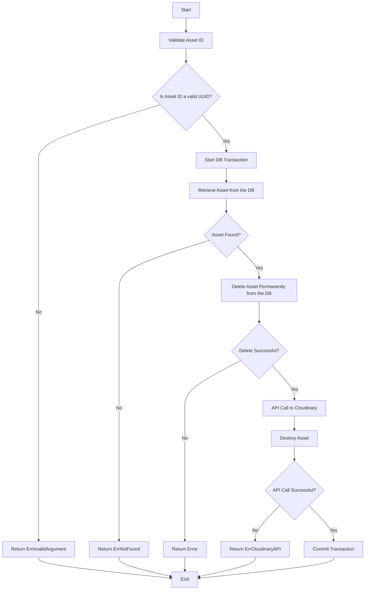

# DeletePermanent Flowchart

This document illustrates the low-level logic of the `DeletePermanent` method in the Cloudinary service.

## Flowchart

```mermaid
graph TD
    A["Start"] --> B["Validate Asset ID"]
    B --> C{"Is Asset ID a valid UUID?"}
    C -->|No| D["Return ErrInvalidArgument"]
    C --> |Yes| E["Start DB Transaction"]
    E --> F["Retrieve Asset from the DB"]
    F --> G{"Asset Found?"}
    G --> |No| H["Return ErrNotFound"]
    G -->|Yes| I["Delete Asset Permanently from the DB"]
    I --> J{"Delete Successful?"}
    J --> |No| K["Return Error"]
    J --> |Yes| L["API Call to Cloudinary"]
    L --> M["Destroy Asset"]
    M --> N{"API Call Successful?"}
    N -->|No| O["Return ErrCloudinaryAPI"]
    N -->|Yes| P["Commit Transaction"]
    P --> Q["End"]
    D --> Q
    H --> Q
    K --> Q
    O --> Q
```
