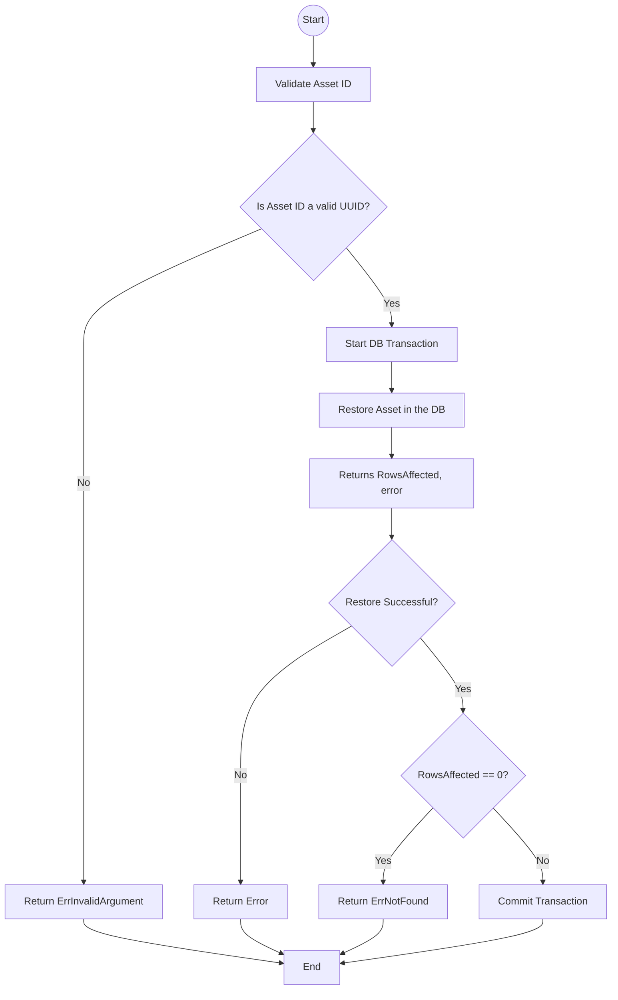

# Restore Flowchart

This document illustrates the low-level logic of the `Restore` method in the Cloudinary service.

## Flowchart

```mermaid
graph TD
    A(("Start")) --> B["Validate Asset ID"]
    B --> C{"Is Asset ID a valid UUID?"}
    C --> |No| D["Return ErrInvalidArgument"]
    C --> |Yes| E["Start DB Transaction"]
    E --> F["Restore Asset in the DB"]
    F --> G["Returns RowsAffected, error"]
    G --> H{"Restore Successful?"}
    H --> |No| I["Return Error"]
    H --> |Yes| J{"RowsAffected == 0?"}
    J --> |Yes| K["Return ErrNotFound"]
    J --> |No| M["Commit Transaction"]
    M --> N["End"]
    D --> N
    I --> N
    K --> N
```
