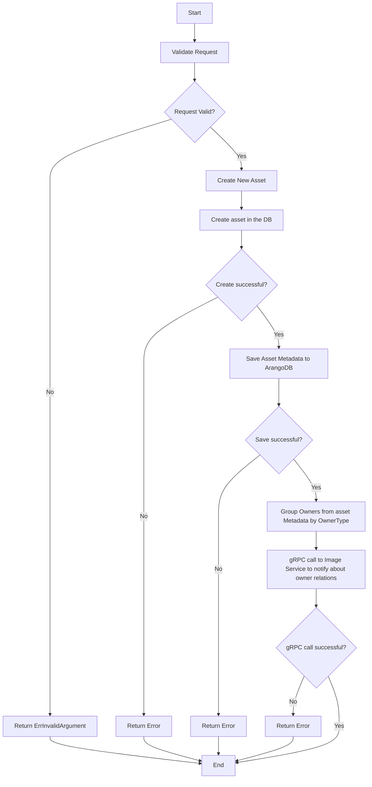

# CreateSignedUploadURL Flowchart

This document illustrates the low-level logic of the `UpdateOwners` method in the Cloudinary service.
See [api documentation](../api.md) for more details.

## Flowchart

