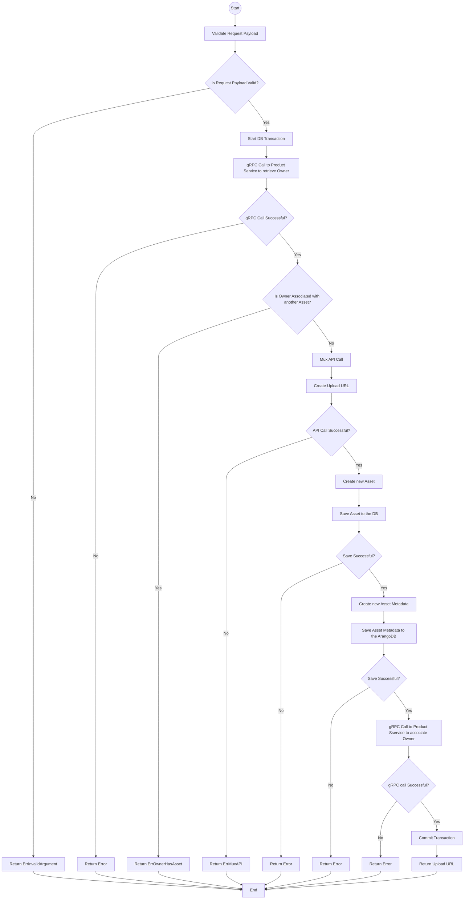

# CreateUploadURL Flowchart

This document illustrates the low-level logic of the `CreateUploadURL` method in the Mux service.

See [api documentation](../api.md) for more details.

## Flowchart

```mermaid
graph TD
    A((Start)) --> B[Validate Request Payload]
    B --> C{Is Request Payload Valid?}
    C --> |No| D[Return ErrInvalidArgument]
    C --> |Yes| E[Start DB Transaction]
    E --> F[gRPC Call to Product Service to retrieve Owner]
    F --> G{gRPC Call Successful?}
    G --> |No| H[Return Error]
    G --> |Yes| I{Is Owner Associated with another Asset?}
    I --> |Yes| J[Return ErrOwnerHasAsset]
    I --> |No| K[Mux API Call]
    K --> L[Create Upload URL]
    L --> M{API Call Successful?}
    M --> |No| N[Return ErrMuxAPI]
    M --> |Yes| O[Create new Asset]
    O --> P[Save Asset to the DB]
    P --> Q{Save Successful?}
    Q -->|No| R[Return Error]
    Q --> |Yes| S[Create new Asset Metadata]
    S --> T[Save Asset Metadata to the ArangoDB]
    T --> U{Save Successful?}
    U --> |No| V[Return Error]
    U --> |Yes| X[gRPC Call to Product Sservice to associate Owner]
    X --> Z{gRPC call Successful?}
    Z --> |No| AA[Return Error]
    Z --> |Yes| BB[Commit Transaction]
    BB --> CC[Return Upload URL]
    CC --> DD[End]
    D --> DD
    H --> DD
    J --> DD
    N --> DD
    R --> DD
    V --> DD
    AA --> DD
```
