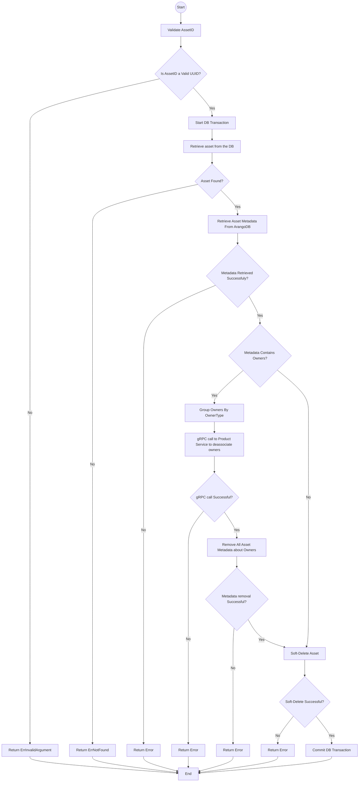

# Delete operation Flowchart

This document illustrates the low-level logic of the `Delete` method in the Mux service.

See [api documentation](../api.md) for more details.

## Flowchart

```mermaid
graph TD
    A((Start)) --> B[Validate AssetID]
    B --> C{Is AssetID a Valid UUID?}
    C -->|No| D[Return ErrInvalidArgument]
    C --> |Yes| E[Start DB Transaction]
    E --> F[Retrieve asset from the DB]
    F --> G{Asset Found?}
    G --> |No| H[Return ErrNotFound]
    G --> |Yes| I[Retrieve Asset Metadata From ArangoDB]
    I --> J{Metadata Retrieved Successfuly?}
    J --> |No| K[Return Error]
    J -->|Yes| L{Metadata Contains Owners?}
    L -->|Yes| M[Group Owners By OwnerType]
    M --> N[gRPC call to Product Service to deassociate owners]
    N --> O{gRPC call Successful?}
    O -->|No| P[Return Error]
    O --> |Yes| Q[Remove All Asset Metadata about Owners]
    Q --> R{Metadata removal Successful?}
    R -->|No| S[Return Error]
    R --> |Yes| T[Soft-Delete Asset]
    T --> Y{Soft-Delete Successful?}
    Y -->|No| X[Return Error]
    Y --> |Yes| V[Commit DB Transaction]
    V --> Z[End]
    D --> Z
    H --> Z
    K --> Z
    P --> Z
    S --> Z
    X --> Z
    L --> |No| T
```
