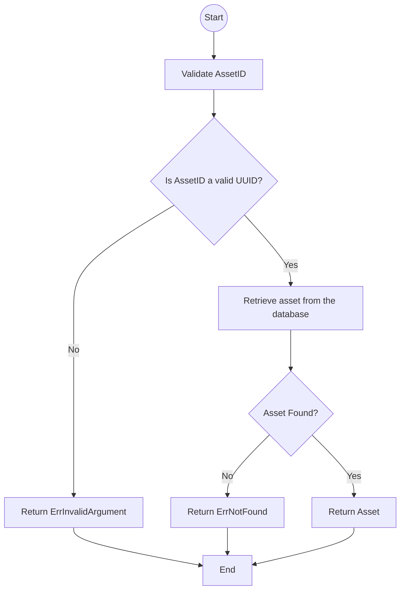

# Get operation Flowchart

This document illustrates the low-level logic of the all `Get` methods in the Mux service:

- `Get`
- `GetWithDeleted`

See [api documentation](../api.md) for more details.

## Flowchart

