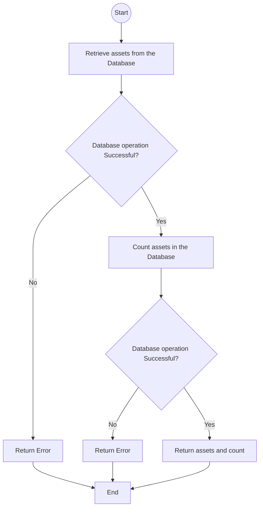

# List operation Flowchart

This document illustrates the low-level logic of the all `List` methods in the Mux service:

- `List`
- `ListDeleted`
- `ListUnowned`

See [api documentation](../api.md) for more details.

## Flowchart

